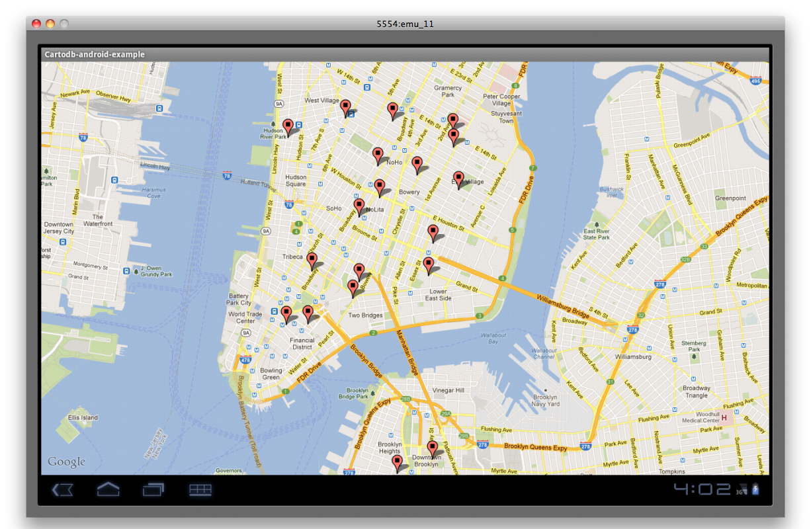

# CartoDB android example

this is a simple example of how to use cartodb-java-client library on android to fetch data. The application shows a map with markers in places where are wifi networks in NYC.

## run the example

You have to install eclipse and android SDK. Then you have to create your maps api key https://developers.google.com/android/maps-api-signup and put it on res/layout/mapview.xml

An screenshot running on a tablet emulator:

Enjoy!
